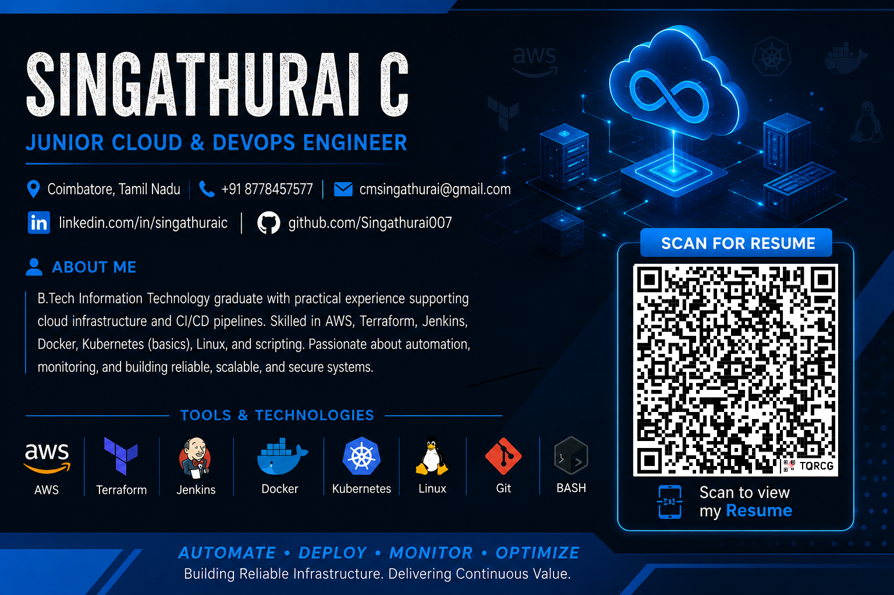

  

<h1 align="center">Hi 👋, I'm Singathurai C</h1>

<h3 align="center">☁️ Junior Cloud & DevOps Engineer</h3>

 <b>AWS • Terraform • Jenkins • GitHub • Linux • Docker • Kubernetes</b> 

👨‍💻 About Me

I'm a B.Tech Information Technology graduate focused on Cloud and DevOps engineering.

I have hands-on experience building CI/CD pipelines, automating AWS infrastructure with Terraform, and deploying applications to Ubuntu EC2 instances using Jenkins, GitHub, SSH and SCP.

I'm passionate about automation, cloud infrastructure, deployment reliability, monitoring, and continuous learning.

🛠️ Technical Skills
☁️ Cloud
AWS
EC2
IAM
Security Groups
CloudWatch
SNS
⚙️ DevOps & CI/CD
Jenkins
Git
GitHub
CI/CD Pipelines
Webhooks
🏗️ Infrastructure as Code
Terraform
Infrastructure Provisioning
terraform init
terraform validate
terraform plan
terraform apply
🐳 Containers & Orchestration
Docker
Kubernetes — Fundamentals
🐧 Linux & Scripting
Ubuntu Linux
Bash / Shell
Python
SSH
SCP
🌐 Web & Database
Apache
MySQL
🚀 Featured Projects
1️⃣ Automated Infrastructure & Application Deployment Pipeline

Jenkins + GitHub + Terraform + AWS + EC2

GitHub
   ↓
Jenkins
   ↓
Terraform
   ↓
AWS EC2
   ↓
SSH / SCP
   ↓
Apache
   ↓
Application Deployment

Highlights:

Integrated GitHub with Jenkins to trigger CI/CD pipelines.
Automated AWS infrastructure provisioning using Terraform.
Implemented Terraform initialization, validation, planning and deployment stages.
Added manual approval before infrastructure deployment.
Automated application deployment to Ubuntu EC2 using SSH and SCP.
Restarted Apache automatically after deployment.
2️⃣ Automated CI/CD Pipeline using Jenkins & GitHub
Developer
    ↓
GitHub
    ↓
Webhook
    ↓
Jenkins
    ↓
Build
    ↓
Test
    ↓
Deploy
    ↓
AWS EC2

Highlights:

Configured GitHub webhooks with Jenkins.
Automated builds and deployments after code pushes.
Implemented build, test and deployment stages.
Reduced manual deployment activities.
3️⃣ AWS EC2 Monitoring & Alerting

CloudWatch + SNS + EC2

AWS EC2
   ↓
CloudWatch
   ↓
CPU Alarm
   ↓
SNS
   ↓
Email Alert

Highlights:

Monitored EC2 instance health and CPU utilization.
Configured CloudWatch alarms.
Integrated Amazon SNS for email notifications.
Improved infrastructure issue awareness and response time.
📚 Currently Learning
Advanced Kubernetes
AWS Cloud Architecture
DevSecOps
GitOps
Infrastructure as Code
Cloud Monitoring
🎯 Career Goal

To build secure, scalable and automated cloud infrastructure and contribute to reliable DevOps solutions through automation, continuous learning and cloud-native technologies.

📊 DevOps Journey
GitHub
   ↓
Jenkins
   ↓
CI/CD
   ↓
Terraform
   ↓
AWS
   ↓
Docker
   ↓
Kubernetes
   ↓
Monitoring
🔗 Connect With Me

   

 <b>🚀 Automate • Deploy • Monitor • Improve</b> 

